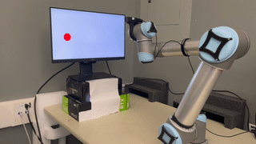
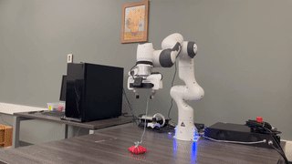
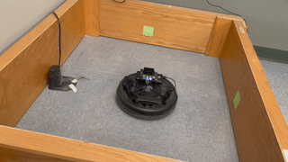
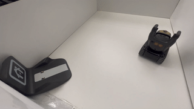

# ReLoD: The Remote-Local Distributed System for Real-time Reinforcement Learning on Vision-Based Robotics Tasks

ReLoD uses a wired local and a wireless remote computer to perform real-time learning, an appealing setting for industrial learning systems. It is a generalist RL system for learning with real robots from scratch! 
Check out how ReLoD learns to perform vision-based tasks on UR5 and Roomba (iRobot Create 2): [Youtube video](https://www.youtube.com/watch?v=7iZKryi1xSY)

## Supported Algorithms
- Soft Actor Critic (SAC)
- Proximal Policy Optimization (PPO)

N.B: All vision-based experiments use Random Augmented Data (RAD) to improve sample efficiency

## Supported Tasks

|  <br> UR-Reacher |  <br /> Franka-VisualReacher |
| --- | --- |

|  <br> Create-Reacher |  <br /> Vector-ChargerDetector |
| --- | --- |

## Choice of hyper-parameters for UR5 experiments
| **Hyper-parameter** | **Value** |
| Replay buffer | 100K |
| Actor step size | 3e-4 | 
| Critic step size | 3e-4 |
| Entropy coefficient step size | 3e-4 | 
| Batch size | 256 | 
| Discount factor | 0.99 | 
| Update every $k$ steps | 2 | 
| Num. update epochs every $k^{th}$ step | 1 | 
| Actor MLP hidden sizes | [512 512] | 
| Critic MLP hidden sizes | [512 512] | 
| Warm-up time steps | 1000 | 
| Adam optimizer betas | [0.9, 0.999] | 
| Initial temperature | 0.1 | 
| Neural network activation | ReLU | 

## Installation instructions
1. Download Mujoco and license files to ~/.mujoco
2. Install miniconda or anaconda
3. Create a virtual environment:
```bash
conda create --name myenv python=3.6    # Python 3.6 is necessary
conda activate myenv
```
3. Add the following to ~/.bashrc:
```bash
conda activate myenv
export LD_LIBRARY_PATH=$LD_LIBRARY_PATH:/home/<username>/.mujoco/mjpro210/bin   # Change based on mujoco version
export MUJOCO_GL="egl"  # System specific
```
and run:
```bash
source ~/.bashrc
```
4. Install packages with:
```bash
pip install -r requirements.txt
pip install .
```

## Run experiment
```python
 python task_ur5_visual_reacher.py  --work_dir "./results" --mode 'l' --seed 0 --env_steps 200100 
```

## Cite
Wang, Y.⋆, Vasan, G.⋆, & Mahmood, A. R. (2023). Real-time reinforcement learning for vision-based robotics utilizing local and remote computers. In *Proceedings of the 2023 International Conference on Robotics and Automation (ICRA).*


